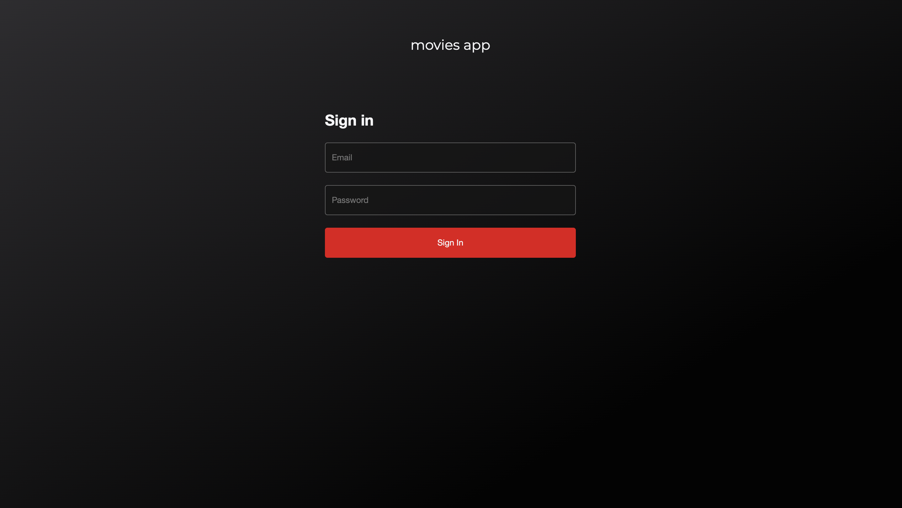

# Movies App

This project implements a web application for managing and viewing movie information. It consists of three main components: LoginPage, MoviesPage, and SingleMoviePage.

## Getting Started

To run this project locally on your machine, follow these steps:

### Prerequisites

- Node.js and npm installed (Download and install from [Node.js website](https://nodejs.org/))

### Installation

1. Clone the repository to your local machine:

```bash
git clone https://github.com/simonalvarado/movieapp.git
```

2. Navigate to the project directory:

```bash
cd movieapp
```

3. Install the project dependencies:

```bash
npm install
```

### Usage

1. Start the development server:

```bash
npm run dev
```

The application will be accessible at http://localhost:3000.

Open your browser and go to http://localhost:3000 to access the app.

#### Dummy User Credentials

For demo purposes, you can use the following dummy credentials to log in:

- Username: `test@example.com`
- Password: `password`

## Structure

The project is structured as follows:

### Login Page

The login page is the first page that users see when they access the application. It contains a form where users can enter their username and password to log in.




### Movies Page

The movies page displays a list of movies fetched from an external API. It includes sections for new releases, recommended movies, recommended series, and popular anime.


## Contributing

Contributions are welcome! Feel free to submit a pull request or open an issue if you find a bug or have a feature request.

## Contact

For any questions or comments, please contact me at my email: simonjesusalvarado@gmail.com